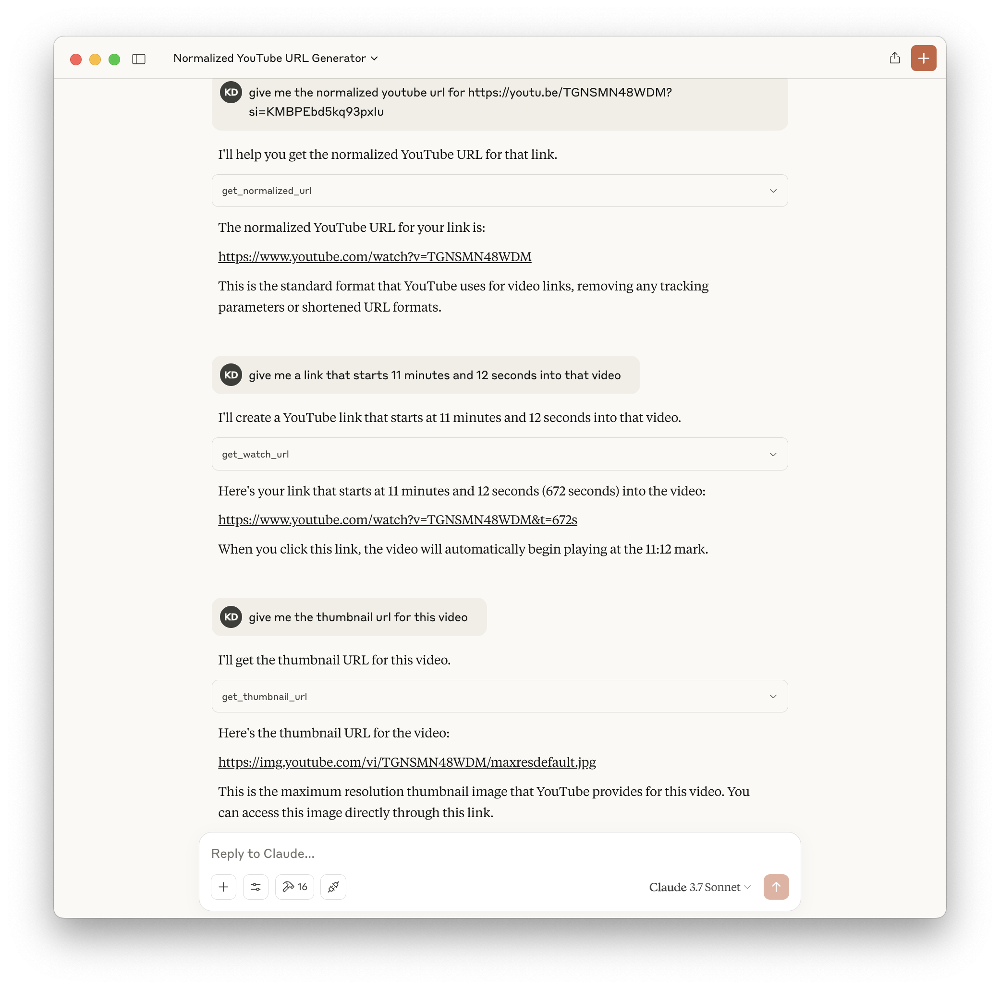

# yt-mcp-server

MCP server with various utility functions for dealing with YouTube data. This server provides tools for working with YouTube URLs, video IDs, and thumbnails.



## 📖 Resources

- [Model Context Protocol](https://modelcontextprotocol.io/introduction)

## Prerequisites

- Python 3.12 or higher
- [UV](https://github.com/astral-sh/uv) package manager

## Setup

### 1. Install UV

If you haven't installed UV yet, you can install it using:

```bash
curl -LsSf https://astral.sh/uv/install.sh | sh
```

### 2. Clone the Repository

```bash
git clone https://github.com/your-username/yt-mcp-server.git
cd yt-mcp-server
```

### 3. Install Dependencies

```bash
uv venv
source .venv/bin/activate  # On Unix/macOS
# or
.venv\Scripts\activate  # On Windows
uv pip install -e .
```

### 4. Configure MCP Client

Add the following configuration to your MCP client settings:

```json
{
    "mcpServers": {
        "yt-mcp-server": {
            "command": "uv",
            "args": [
                "--directory",
                "/ABSOLUTE/PATH/TO/PARENT/FOLDER/yt-mcp-server",
                "run",
                "main.py"
            ]
        }
    }
}
```

## Available Tools

The following tools are available to the LLM:

- `get_watch_url`: Returns the YouTube watch URL for a given video ID, optionally starting at a specific time
  - Parameters:
    - `video_id`: The YouTube video ID
    - `start_time`: (Optional) The start time in seconds

- `get_thumbnail_url`: Returns the thumbnail URL for a given YouTube video ID
  - Parameters:
    - `video_id`: The YouTube video ID

- `get_normalized_url`: Normalizes various YouTube URL formats to the canonical watch URL and extracts the video ID
  - Parameters:
    - `url`: The YouTube URL to normalize